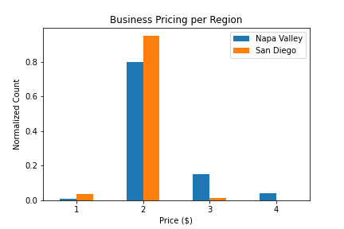
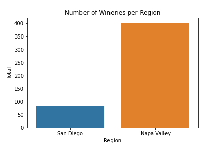
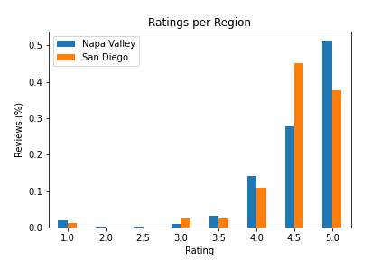

# Putting Down Roots: Opening a Winery in California

**Authors**: Ben McCarty, Giada "Jax" Garnett

## Overview

A one-paragraph overview of the project, including the business problem, data, methods, results and recommendations.
- We want to plant a winery in California, and we want to choose the best market. We know that Napa Valley is well-known, but we would like to investigate other areas for comparison.
- We used data from the Yelp API to generate business metrics for review.
- After generating and cleaning the data, we explored the data via different visualizations.
- Our visualizations showed that there are minimal differences in prices for the San Diego area, with a small increase in differences within the Napa Valley market. 
-- Additionally, it seems that most reviewers are happy with the wineries in Napa Valley, but there are fewer 5-star ratings versus 4.5-star ratings in San Diego. 
--- The fewer reviews show opportunities to steal business by focusing on service excellence.
- Our recommendations are to start the winery in San Diego because of 
-- lack of saturation; diversity
-- #2
-- #3

## Business Problem

We want to decide where to open our winery, and we need to consider a few points:
- We have limited locations: wineries depend on proper climate; plently of land; and clients from near and far. Where are there pre-existing wineries?
- We wanted to determine the market conditions for specific regions, such as the grouping of competition; client satisfaction; and target markets (based on price)).
- Based off the resulting data, we were able to determine the ideal location considering market saturation; dissatisfied clientele; and under-served price points.

## Data

We filtered data generated by Yelp API requests to select the data that answered our business questions.
- We used winery ratings, pricing, number of reviews, and locations (latitude/longitude) data for analysis.

## Methods

Due to the small differences between data points, most visualizations would not show meaningful data.
We were able to use bar graphs to compare price counts and ratings. These visualizations showed the lack of different price points for San Diego, as well as the lower number of 5-star ratings versus 4.5-star ratings.
Finally, we used the location data to create geospatial maps to show the clusters of businesses for each region, demonstrating that the San Diego area has more physical space available.

## Results

We used these visualizations to identify the opportunities for our business to meet the needs for underserved markets. Our results may change due to changes in location, as wineries are climate-restricted; depend on both local and non-local markets; and more popular/established wine regions may target other price ranges.

### Visual 1

### Visual 2

### Visual 3

## Conclusions

We decided it is best to start a winery in San Diego.