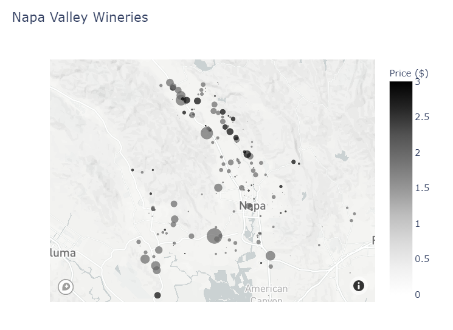
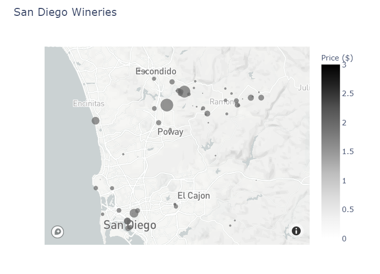
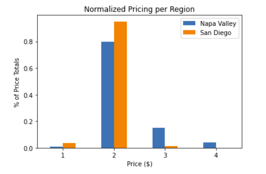

# Putting Down Roots: Opening a Winery in California

**Authors**: Ben McCarty, Giada "Jax" Garnett

## Overview

Our task was to create a bsuiness proposition for a new business of our choice, comparing two separate regions to determine the best location. We were interested in opening a winery in California, comparing Napa Valley and San Diego to make the most profitable decision.

We used data from the Yelp API to guide our decision, using API requests to gather the data. Once we collected the data, we parsed and cleaned it to collect the most relevant data for analysis. After reviewing our statistical analysis and comparing visualizations between the regions, we decided that San Diego would be the better area.

- Our visualizations showed that there are minimal differences in prices for the San Diego area, with a small number of higher-priced wineries within the Napa Valley market. 
- Additionally, it seems that most reviewers are happy with the wineries in Napa Valley, but there are fewer 5-star ratings versus 4.5-star ratings in San Diego. 

    - The fewer reviews show opportunities to pull business away from the established wineries by focusing on service excellence. If customers are not satisfied with the existing wineries, they are more likely to try out new options.

- Our recommendations are to start the winery in San Diego because of 
  - Fewer number of competitors in the market
  - Very low competition in the higher-priced markets
  -  

***
## Business Problem

We want to open a winery, and we know that Napa Valley is one of the best-known locations for wineries. We also want to investigate a lesser-known region for other opportunities. We chose San Diego as it is in southern California, away from Napa Valley to the north.


We needed to consider:
- **Q1: What do the regions look like statistically?**
  
- **Q2: What are the price ranges for each area?**
        
- **Q3: Ratings**
 
- **Q4: Number of reviews**
***
## Data

We filtered data generated by Yelp API requests to select the data that answered our business questions. Our analysis focused on winery ratings, pricing, number of reviews, and location data (latitude/longitude) data for analysis.

***
## Methods

Using geospatial mapping, we highlighted the cluster density of the wineries in each region. Napa Valley shows very strong clusters in the north and southwest; San Diego shows more sparsely-located wineries.


***
## Results

We used these visualizations to identify the opportunities for our business to meet the needs for underserved markets. Our results may change due to changes in location, as wineries are climate-restricted; depend on both local and non-local markets; and more popular/established wine regions may target other price ranges.

### Napa Valley Wineries
<br>


### San Diego Wineries
<br>


### Normalized Pricing per Region
<br>


### Normalized Ratings per Region
<br>


***
## Conclusions

As a result of our analyses, we recommend opening a new winery in the San Diego region. Further analysis and data are required to make a full decision. Additional data may include reviewing real estate pricing; anticipating/reacting to changing sales and marketing tactics; and considering the environmental compatibility of the regions. Finally, stakeholders should also take into consideration the threat of wildfires and droughts in the areas as well.

Additional insights may be gained by using Natural Language Processing (NLP) methods on the business reviews. Studying the sentiments; word choices; and complaints/suggestions may lead to additional insight into different challenges and opportunities for a new winery.

***

## For More Information

Please review our full analysis in our Jupyter Notebook or our presentation.

For any additional questions, please contact: 

**Ben McCarty**             bmccarty505@gmail.com

**Giada "Jax" Garnett**    @pleasecallmejax

***
## Repository Structure

```
├── README.md
├── Planting a Winery.ipynb
├── Phase 1 Project - Ben & Jax.pdf
├── data
└── images
```
